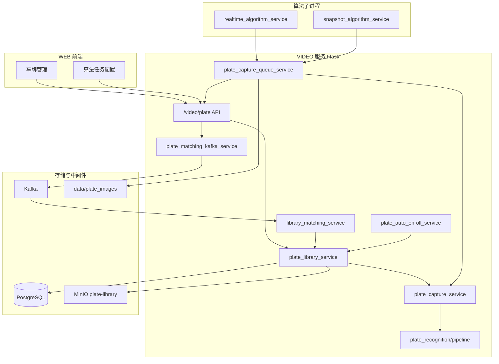
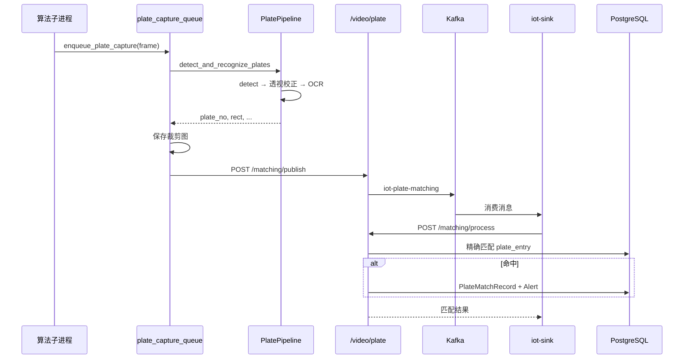

# VIDEO 车牌库功能设计文档

> 版本：与当前代码库一致（`plate_detect.onnx` / `plate_rec.onnx` + PostgreSQL 精确匹配）  
> 路由前缀：`/video/plate`

---

## 1. 概述

### 1.1 目标

在 EasyAIoT 的 **VIDEO** 模块中提供完整的车牌库管理能力，包括：

| 能力 | 说明 |
|------|------|
| 车牌库管理 | 创建库、录入/更新/删除车牌条目、业务标签、启用/停用 |
| 车牌识别 | 上传图片或设备抓帧，使用 ONNX 两步流水线识别车牌号与颜色 |
| 1:N 匹配 | 在指定车牌库中按**规范化车牌号**精确匹配，返回车主等信息 |
| 算法任务联动 | 实时/抓拍算法任务开启「车牌匹配」后，从视频流异步识别并投递 Kafka |
| 自动录入 | 绑定摄像头，在限时内自动发现「库中不存在」的新车牌并入库 |
| 归一化 | 合并库内重复或 OCR 近似重复的车牌条目 |
| 匹配记录 | 保存算法侧产生的匹配请求与命中结果，命中时联动告警 |

### 1.2 设计原则

- **定位与识别分离**：`plate_detect.onnx`（YOLO26 Pose）负责四角定位；`plate_rec.onnx`（CRNN+颜色头）负责号码识别；**匹配在 PostgreSQL 中按字符串精确比对**，不使用向量库。
- **透视校正优先**：定位模型回归 4 角点，通过透视变换拉正后再 OCR，提升倾斜场景识别率。
- **与主算法解耦**：视频流上的车牌识别走独立队列，不阻塞 YOLO 检测、叠框、告警主链路。
- **业务数据在 PostgreSQL**：车牌库、条目、匹配记录；**展示用图片在 MinIO**（桶 `plate-library`）；**算法裁剪图在本地** `data/plate_images/`。

### 1.3 与人脸库的关键差异

| 对比项 | 人脸库 | 车牌库 |
|--------|--------|--------|
| 匹配方式 | Milvus 向量相似度 | 车牌号字符串精确匹配 |
| 中间件 | Milvus 必需 | 无 Milvus |
| 识别输出 | 512 维 embedding | 车牌字符串 + 颜色 |
| 人员概念 | `FacePerson` 归一化 | 无人员层，直接 `PlateEntry` |
| 匹配阈值 | 相似度 0.50~0.70 | 规范化后完全一致（归一化支持 OCR 近似合并） |

---

## 2. 系统架构

### 2.1 逻辑分层



### 2.2 三条主链路

#### 链路 A：管理端录入 / 识别 / 匹配（同步 HTTP）

```
上传图片 → plate_detect 定位四角 → 透视校正 → plate_rec OCR
         → 返回 plate_no / plate_color
         → （录入时）原图/裁剪图上传 MinIO → PlateEntry 写 PostgreSQL
         → （匹配时）规范化 plate_no → 库内精确查询
```

#### 链路 B：算法任务实时抓牌（异步，不阻塞主流程）

```
视频帧 → 主算法线程 copy 帧 → plate_capture 队列
      → Worker: plate_detect + plate_rec → 保存裁剪图到 data/plate_images/...
      → HTTP POST /video/plate/matching/publish → Kafka(iot-plate-matching)
      → 消费端调 /matching/process → 多库精确匹配 → 命中写告警 + PlateMatchRecord
```

#### 链路 C：摄像头自动录入（定时调度）

```
run.py / APScheduler tick → 轮询摄像头抓帧 → 检测+OCR
                         → 库内未命中 → add_entry 入库（带裁剪图）
```

---

## 3. 识别模型与流水线

> 实现封装于 `app/utils/plate_recognition/`。

### 3.1 固定模型（VIDEO 根目录）

| 文件 | 大小约 | 作用 | 配置项 |
|------|--------|------|--------|
| `plate_detect.onnx` | ~38MB | YOLO26s **Pose** 定位，输出框 + 4 角点 + 单层/双层类型 | `PLATE_DETECT_MODEL_PATH` |
| `plate_rec.onnx` | ~51KB | CRNN 序列识别 + 5 类颜色头 | `PLATE_REC_MODEL_PATH` |
| `plate_rec.onnx.data` | — | 识别模型权重数据（必需） | 与 rec 同目录 |

路径定义见：`app/utils/plate_model_paths.py`。

模型缺失时可通过 `POST /video/plate/model/download` 触发后台下载（需配置 `PLATE_DETECT_MODEL_DOWNLOAD_URL` / `PLATE_REC_MODEL_DOWNLOAD_URL`），或手动放置到 VIDEO 根目录。

### 3.2 两步流水线

```
输入图像 (BGR)
    │
    ▼
┌─────────────────────────────────────┐
│ 第 1 步：车牌定位                     │
│ 模型: plate_detect.onnx (YOLO26 Pose)│
│ 输出: 检测框 + 4角点 + 单层/双层类型   │
└─────────────────────────────────────┘
    │
    ▼
┌─────────────────────────────────────┐
│ 几何处理                             │
│ · 角点排序 (左上/右上/右下/左下)       │
│ · 计算倾斜角                         │
│ · 透视变换 four_point_transform      │
│ · 双层牌 split_merge（类型=1 时）     │
└─────────────────────────────────────┘
    │
    ▼
┌─────────────────────────────────────┐
│ 第 2 步：号码识别                     │
│ 模型: plate_rec.onnx (CRNN+颜色头)    │
│ 输出: 车牌字符串 + 颜色类别            │
└─────────────────────────────────────┘
    │
    ▼
结构化 PlateResult → HTTP / Kafka / 入库
```

### 3.3 定位模型：`plate_detect.onnx`

| 属性 | 值 |
|------|-----|
| 来源 | `yolo26s-plate-detect.pt` 导出 |
| 架构 | YOLO26s **Pose**（非普通 detect） |
| 输入 | `images`: `[1, 3, 640, 640]`，RGB，归一化 `/255` |
| 输出 | `output0`: `[1, 300, 14]`，内置 NMS 的端到端结果 |
| 类别 | `0=single`（单层牌），`1=double`（双层牌） |

**输出行 `row[14]` 字段定义：**

| 索引 | 含义 |
|------|------|
| `row[0:4]` | 检测框 `x1, y1, x2, y2`（letterbox 坐标系） |
| `row[4]` | 定位置信度 |
| `row[5]` | 类别 ID（0 单层 / 1 双层） |
| `row[6:14]` | 4 个角点 `(x,y)` × 4，后续 `order_points` 重排 |

> **为何用 Pose 而非 Detect？**  
> 普通检测只给矩形框，倾斜较大时裁剪区域包含大量背景，OCR 准确率下降。Pose 模型同时回归四角，可精确做透视拉正。

### 3.4 识别模型：`plate_rec.onnx`

| 属性 | 值 |
|------|-----|
| 来源 | `plate_rec_color.pth` 导出 |
| 架构 | `myNet_ocr_color`（类 CRNN 序列识别 + 颜色分类头） |
| 输入 | `images`: `[1, 3, 48, 168]` |
| 输出 | `plate_logits`: `[1, 21, 78]` — 21 时间步 × 78 字符类 |
| 输出 | `color_logits`: `[1, 5]` — 5 种颜色 |

**字符表（78 类，index 0 为 CTC blank）：**

```
#京沪津渝冀晋蒙辽吉黑苏浙皖闽赣鲁豫鄂湘粤桂琼川贵云藏陕甘青宁新学警港澳挂使领民航危
0123456789ABCDEFGHJKLMNPQRSTUVWXYZ险品
```

**颜色映射：**

| index | 颜色 |
|-------|------|
| 0 | 黑色 |
| 1 | 蓝色 |
| 2 | 绿色 |
| 3 | 白色 |
| 4 | 黄色 |

**识别前处理：** 尺寸 `168×48`（宽×高）；归一化 `(pixel/255 - 0.588) / 0.193`。

### 3.5 核心算法步骤

| 步骤 | 代码位置 | 说明 |
|------|----------|------|
| Letterbox 预处理 | `pipeline.py` → `_detect()` | 等比缩放至 640，灰条填充，记录 ratio/padding |
| 角点排序 | `order_points()` | 左上 → 右上 → 右下 → 左下 |
| 倾斜角 | `calc_tilt_angle()` | `\|angle\| >= tilt_threshold`（默认 3°）标记倾斜 |
| 透视拉正 | `four_point_transform()` | 四边形 → 矩形 |
| 双层拼接 | `double_plate_split_merge.py` → `get_split_merge()` | 类型=1 时上下行拼接为单行 |
| CTC 解码 | `decode_plate()` | 跳过 blank、去连续重复、映射字符表 |

### 3.6 识别结果数据结构

**代码位置：** `pipeline.py` → `@dataclass PlateResult`

| 字段 | 类型 | 说明 |
|------|------|------|
| `plate_no` | str | 识别出的车牌号 |
| `plate_color` | str | 颜色（中文） |
| `detect_conf` | float | 定位置信度 |
| `plate_type` | int | 0 单层 / 1 双层 |
| `tilt_angle` | float | 倾斜角度（度） |
| `is_tilted` | bool | 是否超过倾斜阈值 |
| `rect` | list[int] | 检测框 `[x1,y1,x2,y2]` |
| `landmarks` | list | 四角坐标 `[[x,y], ...]` |

**封装入口：** `plate_capture_service.detect_and_recognize_plates()` 将 `PlateResult` 转为 dict 供 API / 队列 / 自动录入使用。

### 3.7 支持的车牌类型

| 类型 | 处理方式 |
|------|----------|
| 单行蓝/黄/绿/白牌 | 标准流程 |
| 双层黄牌/白牌/绿牌 | 定位类型=1 → split_merge |
| 港澳粤Z、民航、教练车等 | 字符表已包含特殊字符 |

### 3.8 性能参考

在 CPU（Intel i9-14900K）上单帧 `pipeline.predict()`：

| 场景 | 耗时 |
|------|------|
| 单牌（640×474） | ~70–90 ms |
| 双牌（1920×1080 级） | ~150–200 ms |

瓶颈主要在定位模型；识别模型耗时可忽略。安装 `onnxruntime-gpu` 且 CUDA 可用时，Pipeline 优先选用 `CUDAExecutionProvider`。

---

## 4. 数据模型

### 4.1 PostgreSQL（`models.py`）

```mermaid
erDiagram
    PlateLibrary ||--o{ PlateEntry : contains
    PlateLibrary ||--o| PlateAutoEnrollTask : has
    PlateLibrary ||--o{ PlateMatchRecord : matched_in
    AlgorithmTask }o--o{ PlateLibrary : plate_library_ids

    PlateLibrary {
        int id PK
        string name
        string code UK
        text business_tags
        int plate_count
        bool is_enabled
    }
    PlateEntry {
        int id PK
        int library_id FK
        string plate_no
        string plate_color
        string owner_name
        string image_url
        bool is_enabled
    }
    PlateAutoEnrollTask {
        int library_id FK UK
        text device_ids
        bool is_running
        datetime expires_at
    }
    PlateMatchRecord {
        int id PK
        string device_id
        int library_id
        string plate_no
        bool matched
        int alert_id
    }
    AlgorithmTask {
        bool plate_detection_enabled
        bool plate_matching_enabled
        text plate_library_ids
    }
```

| 表 | 说明 |
|----|------|
| `plate_library` | 车牌库；`code` 为 12 位 UUID 片段，唯一；`plate_count` 冗余统计 |
| `plate_entry` | 单条车牌记录；同库内 `plate_no` 唯一（规范化后） |
| `plate_auto_enroll_task` | 自动录入配置与运行状态；每库最多一条 |
| `plate_match_record` | 算法/Kafka 侧匹配记录；命中时含 `alert_id` |
| `algorithm_task` | `plate_detection_enabled`、`plate_matching_enabled`、`plate_library_ids` |

**车牌号规范化规则**（`plate_library_service._normalize_plate_no`）：

- 去首尾空格、转大写、去内部空格
- 录入与匹配均走同一规范化逻辑

**车牌号格式校验**（`PLATE_NO_PATTERN`）：5~10 位，字符集与 OCR 字符表一致。

### 4.2 MinIO

- **桶名**：`PLATE_IMAGE_BUCKET`（默认 `plate-library`）
- **对象路径**：`{library_id}/{uuid}.jpg`
- **公开 URL**：由 `MINIO_PUBLIC_ENDPOINT` 或 `MINIO_ENDPOINT` 拼接

### 4.3 算法任务本地车牌图

- **目录**：`PLATE_IMAGES_DIR`，默认 `VIDEO/data/plate_images/`
- **结构**：`task_{taskId}/{deviceId}/matching/{timestamp}_frame{n}_{plateNo}.jpg`

---

## 5. 模块职责

| 模块 | 路径 | 职责 |
|------|------|------|
| `plate_model_paths` | `app/utils/plate_model_paths.py` | 模型路径常量 |
| `plate_model_download` | `app/utils/plate_model_download.py` | 模型下载与状态查询 |
| `plate_recognition/pipeline` | `app/utils/plate_recognition/pipeline.py` | 两步 ONNX 流水线 |
| `double_plate_split_merge` | `app/utils/plate_recognition/double_plate_split_merge.py` | 双层牌上下行拼接 |
| `plate_capture_service` | `app/utils/plate_capture_service.py` | 加载 Pipeline，单帧检测+识别 |
| `plate_capture_queue_service` | `app/utils/plate_capture_queue_service.py` | 抓牌队列、落盘、调 publish API |
| `plate_library_service` | `app/services/plate_library_service.py` | 库/条目 CRUD、匹配、归一化 |
| `plate_matching_kafka_service` | `app/services/plate_matching_kafka_service.py` | 组装消息、发 Kafka |
| `library_matching_service` | `app/services/library_matching_service.py` | 多库匹配编排、命中告警 |
| `plate_auto_enroll_service` | `app/services/plate_auto_enroll_service.py` | 自动录入 tick |
| `plate` Blueprint | `app/blueprints/plate.py` | HTTP 路由 |

---

## 6. 业务流程

### 6.1 车牌入库（`add_entry`）

1. 校验库存在；规范化 `plate_no`；检查同库唯一性。  
2. 若上传图片 → 上传 MinIO，写入 `image_url`。  
3. 创建 `PlateEntry`（可选 `owner_name`、`plate_color`、`remark` 等）。  
4. 刷新库 `plate_count`。

> 录入时**不强制**走 OCR：可直接手工填写车牌号；图片仅作展示/佐证。

### 6.2 图片识别（`recognize_plates_in_image`）

1. 解码图片 → `detect_and_recognize_plates()`。  
2. 返回每张牌的 `plate_no`、`plate_color`、`detect_conf`、`rect`、`landmarks` 等。

### 6.3 库内匹配（`match_plate_in_library`）

1. 规范化 `plate_no`。  
2. 查询 `plate_entry`：`library_id` + `plate_no` + `is_enabled=True`。  
3. 返回 `{ matched, plate_no, entry }`。

**多库匹配**（`match_plate_across_libraries`）：按 `plate_library_ids` 顺序依次匹配，**命中即停**。

### 6.4 算法任务车牌匹配

**前置条件**（`AlgorithmTask`）：

- `plate_matching_enabled = true`
- `plate_library_ids` 已配置（JSON 数组，支持多库）
- 任务类型为 `realtime` 或 `snap`

**运行时**（`run_deploy.py`）：

1. 任务启动时若开启匹配 → `start_plate_capture_workers`。  
2. 每帧处理中调用 `try_send_plate_matching_for_frame` → 非阻塞 `enqueue_plate_capture`。  
3. Worker 识别车牌 → 保存 jpg → `POST /video/plate/matching/publish`。  
4. `send_plate_matching_to_kafka` → 主题 `KAFKA_PLATE_MATCHING_TOPIC`（默认 `iot-plate-matching`）。

**与 `plate_detection_enabled` 的关系**：

- `plate_detection_enabled`：控制主 YOLO 算法是否检测/展示「车牌」类别目标。  
- `plate_matching_enabled`：控制是否走独立 ONNX 流水线做号码识别与库匹配。  
- 二者独立，可只开检测、只开匹配、或同时开启。

### 6.5 Kafka 异步匹配

| 步骤 | 组件 | 说明 |
|------|------|------|
| 生产 | 算法进程 → `matching/publish` | 消息含 `plateNo`、`plateImagePath`、`taskId` 等 |
| 投递 | `plate_matching_kafka_service` | 主题 `iot-plate-matching` |
| 消费 | 外部服务（如 iot-sink） | 订阅 Kafka，调 VIDEO 处理接口 |
| 处理 | `POST /video/plate/matching/process` | `process_plate_matching_message`：多库精确匹配 |
| 命中 | `library_matching_service` | 写 `PlateMatchRecord` + 创建告警（`plate_library_match`） |
| 结果 | `KAFKA_PLATE_MATCHING_RESULT_TOPIC` | 可扩展回写命中结果 |

**Kafka 消息主要字段：**

```json
{
  "taskId": 1,
  "taskName": "入口车牌",
  "taskType": "realtime",
  "deviceId": "cam-001",
  "deviceName": "东门摄像头",
  "plateNo": "皖A12345",
  "plateColor": "蓝色",
  "plateImagePath": "/path/to/crop.jpg",
  "detectConf": 0.92,
  "rect": [100, 200, 300, 250],
  "landmarks": [[...], ...],
  "timestamp": "2026-06-02T10:00:00"
}
```

### 6.6 车牌归一化

针对 OCR 重复录入或手工重复录入：

- **预览**：`preview_normalize_groups` — `threshold=1.0` 为规范化后完全一致；降低阈值（0.75~1.0）允许 OCR 近似重复（`SequenceMatcher`）。  
- **合并**：`merge_plate_entries` — 保留信息较全的条目，补全车主/图片字段，删除冗余。  
- **批量**：`merge_all_normalize_groups` — 按预览建议一键合并。

### 6.7 自动录入（`plate_auto_enroll_service`）

- 用户通过 API 配置 `device_ids`、`duration_minutes`、`capture_interval_sec` 后手动 `start`。  
- APScheduler 每 5 秒 tick（`plate_auto_enroll_tick`），仅当存在 `is_running=true` 任务时运行。  
- 轮询摄像头抓帧 → OCR → 取置信度最高车牌 → 库内未命中则 `add_entry`（带矩形裁剪图）。  
- 到期或手动 `stop` 结束；服务重启时 `run.py` 会将遗留 `is_running` 重置为 false。

---

## 7. HTTP API 清单

基础路径：**`/video/plate`**

### 7.1 健康与模型

| 方法 | 路径 | 说明 |
|------|------|------|
| GET | `/health` | 模型是否就绪 |
| GET | `/model/status` | 模型路径、下载进度 |
| POST | `/model/download` | 后台下载 ONNX 模型 |

### 7.2 车牌库管理

| 方法 | 路径 | 说明 |
|------|------|------|
| GET/POST | `/libraries` | 列表 / 创建车牌库 |
| GET/PUT/DELETE | `/libraries/{id}` | 详情 / 更新 / 删除 |
| GET | `/libraries/{id}/entries` | 条目分页列表 |
| POST | `/libraries/{id}/entries` | 单条录入（multipart `file` 可选） |
| PUT/DELETE | `/entries/{id}` | 更新 / 删除条目 |
| POST | `/entries/batch-delete` | 批量删除 |

### 7.3 识别与匹配

| 方法 | 路径 | 说明 |
|------|------|------|
| POST | `/recognize/image` | 上传图片识别所有车牌 |
| POST | `/recognize/device/{device_id}/snapshot` | 设备抓帧识别 |
| POST | `/libraries/{id}/match` | 传 `plate_no` 或上传图片后在库内匹配 |

### 7.4 归一化与自动录入

| 方法 | 路径 | 说明 |
|------|------|------|
| GET | `/libraries/{id}/normalize/preview` | 重复车牌分组预览 |
| POST | `/libraries/{id}/normalize/merge` | 手动合并 |
| POST | `/libraries/{id}/normalize/merge-all` | 按预览批量合并 |
| GET/PUT | `/libraries/{id}/auto-enroll` | 自动录入配置 |
| POST | `/libraries/{id}/auto-enroll/start` | 启动 |
| POST | `/libraries/{id}/auto-enroll/stop` | 停止 |

### 7.5 算法 / Kafka

| 方法 | 路径 | 说明 |
|------|------|------|
| POST | `/matching/publish` | 算法进程投递 Kafka |
| POST | `/matching/process` | 消费端：匹配 + 落库 + 告警 |
| GET | `/matching/records` | 匹配记录分页 |

---

## 8. 配置项

详见 `env.example` 及代码内默认值。

### 8.1 模型路径

```ini
# PLATE_DETECT_MODEL_PATH=./plate_detect.onnx
# PLATE_REC_MODEL_PATH=./plate_rec.onnx
PLATE_DETECT_MODEL_DOWNLOAD_URL=
PLATE_REC_MODEL_DOWNLOAD_URL=
PLATE_CAPTURE_CONF_THRESHOLD=0.25
PLATE_CAPTURE_TILT_THRESHOLD=3.0
```

### 8.2 抓牌队列

```ini
PLATE_CAPTURE_QUEUE_SIZE=8
PLATE_CAPTURE_WORKER_THREADS=1
PLATE_CAPTURE_KEEP_LATEST=true
PLATE_CAPTURE_KEEP_LATEST_THRESHOLD=4
PLATE_IMAGES_DIR=./data/plate_images
```

### 8.3 Kafka

```ini
KAFKA_PLATE_MATCHING_TOPIC=iot-plate-matching
KAFKA_PLATE_MATCHING_RESULT_TOPIC=iot-plate-matching-result
```

### 8.4 MinIO

```ini
PLATE_IMAGE_BUCKET=plate-library
MINIO_ENDPOINT=...
MINIO_PUBLIC_ENDPOINT=...
```

### 8.5 GPU

```ini
USE_GPU=false
# 为 true 时 ONNX Runtime 优先 CUDAExecutionProvider
```

---

## 9. 依赖与部署

### 9.1 Python 依赖（`requirements-base.txt`）

- `onnxruntime` / `onnxruntime-gpu` — 推理
- `opencv-python`、`numpy`
- `requests` — 队列 Worker 调 publish API

### 9.2 中间件

| 组件 | 用途 |
|------|------|
| PostgreSQL | 业务表 |
| MinIO | 车牌录入图片 |
| Kafka | 算法异步匹配（可选） |

> 车牌库**不需要** Milvus。

### 9.3 部署检查清单

- [ ] `VIDEO/plate_detect.onnx`、`VIDEO/plate_rec.onnx`、`plate_rec.onnx.data` 已放置  
- [ ] MinIO 桶 `plate-library` 可写  
- [ ] 算法任务机器能访问 VIDEO 的 `/video/plate/matching/publish`  
- [ ] 开启车牌匹配的算法任务已配置 `plate_library_ids`  
- [ ] `data/plate_images` 目录有写权限  
- [ ] Kafka 消费端已对接 `/video/plate/matching/process`（若使用异步匹配）

### 9.4 注册入口

- Blueprint：`run.py` → `app.register_blueprint(plate.plate_bp, url_prefix='/video/plate')`
- 服务重启时重置遗留自动录入任务（`PlateAutoEnrollTask.is_running`）

---

## 10. 前端与其它模块

| 模块 | 路径 | 说明 |
|------|------|------|
| WEB 车牌管理 | `WEB/src/views/plate-manage/` | 车牌库列表页 |
| WEB 组件 | `WEB/src/views/camera/components/PlateLibrary/` | 库弹窗、条目、归一化、自动录入、模型下载 |
| WEB API | `WEB/src/api/device/plate_library.ts` | 封装 `/video/plate` |
| 算法任务弹窗 | `WEB/.../AlgorithmTaskModal.vue` | `plate_matching_enabled`、`plate_library_ids` |
| 实时算法 | `services/realtime_algorithm_service/run_deploy.py` | 抓牌队列、publish |
| 抓拍算法 | `services/snapshot_algorithm_service/run_deploy.py` | 同上 |

---

## 11. 匹配规则说明

### 11.1 精确匹配

库内匹配为**规范化字符串完全一致**，不支持模糊匹配（除归一化工具用于合并重复数据）。

示例：

| OCR 识别 | 库中存储 | 匹配结果 |
|----------|----------|----------|
| `皖A12345` | `皖A12345` | 命中 |
| `皖A12345` | `皖a12345` | 命中（规范化后相同） |
| `皖A1234S` | `皖A12345` | 未命中（OCR 错误需归一化合并或修正库数据） |

### 11.2 多库策略

`plate_library_ids` 按配置顺序检索，**第一个命中的库**作为匹配结果，后续库不再查询。

### 11.3 告警事件

命中时创建告警：

- **event**：`plate_library_match`
- **object**：车牌号
- **information**：含库信息、车主、`detect_conf`、裁剪图路径等

---

## 12. 已知限制与后续扩展

| 项 | 说明 |
|----|------|
| OCR 误识别 | 无运行时正则强校验；偶发乱码需归一化合并或人工修正 |
| 匹配方式 | 仅精确匹配，不支持「允许 1 位容错」的在线模糊检索 |
| 定位格式绑定 | `plate_detect.onnx` 输出 `[1,300,14]`，换模型需同步改 `_detect()` |
| 队列单线程默认可配 | 默认可配 1 Worker，高并发场景可调 `PLATE_CAPTURE_WORKER_THREADS` |
| 自动录入 | 每 tick 只处理一个摄像头、一张最高置信度车牌 |
| 扩展建议 | 增加车牌号正则后处理；支持在线模糊匹配；GPU batch 推理；模型热更新 |

---

## 13. 目录结构速查

```
VIDEO/
├── plate_detect.onnx              # 车牌定位（Pose）
├── plate_rec.onnx                 # 车牌 OCR + 颜色
├── plate_rec.onnx.data            # 识别模型权重
├── PLATE_DESIGN.md                # 本文档
├── FACE_DESIGN.md                 # 人脸库设计（对照参考）
├── app/
│   ├── blueprints/plate.py
│   ├── services/
│   │   ├── plate_library_service.py
│   │   ├── plate_matching_kafka_service.py
│   │   ├── plate_auto_enroll_service.py
│   │   └── library_matching_service.py
│   └── utils/
│       ├── plate_model_paths.py
│       ├── plate_model_download.py
│       ├── plate_capture_service.py
│       ├── plate_capture_queue_service.py
│       └── plate_recognition/
│           ├── pipeline.py
│           └── double_plate_split_merge.py
├── data/plate_images/             # 算法裁剪车牌图（默认）
└── services/
    ├── realtime_algorithm_service/run_deploy.py
    └── snapshot_algorithm_service/run_deploy.py
```

---

## 14. 数据流时序图



---

## 15. 关键代码索引

| 功能 | 文件 | 函数/类 |
|------|------|---------|
| 流水线入口 | `plate_recognition/pipeline.py` | `PlatePipeline.predict()` |
| 定位推理 | `plate_recognition/pipeline.py` | `PlatePipeline._detect()` |
| OCR 推理 | `plate_recognition/pipeline.py` | `PlatePipeline._recognize()` |
| 双层拼接 | `double_plate_split_merge.py` | `get_split_merge()` |
| 帧级识别封装 | `plate_capture_service.py` | `detect_and_recognize_plates()` |
| 异步抓牌 | `plate_capture_queue_service.py` | `enqueue_plate_capture()` |
| 库 CRUD | `plate_library_service.py` | `create_library` / `add_entry` |
| 库内匹配 | `plate_library_service.py` | `match_plate_in_library()` |
| 多库匹配+告警 | `library_matching_service.py` | `process_plate_matching_message()` |
| Kafka 投递 | `plate_matching_kafka_service.py` | `send_plate_matching_to_kafka()` |
| 自动录入 | `plate_auto_enroll_service.py` | `run_auto_enroll_tick()` |
| HTTP 路由 | `blueprints/plate.py` | `plate_bp` |

---

## 16. 修订记录

| 日期 | 说明 |
|------|------|
| 2026-06-02 | 初版：车牌库全链路设计，含 YOLO26 Pose + CRNN 识别流水线、API、算法/Kafka 联动 |
